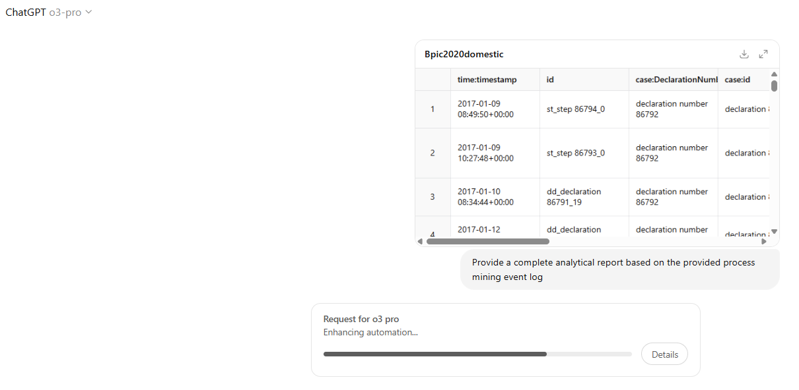

# Agentic Process Mining LLM Benchmark



## What is being measured?

This benchmark evaluates **large‑language models (LLMs)** on their ability to act as **autonomous process mining analysts**.  Given only an event‑log CSV, the model must deliver a complete written report that would be useful to a business stakeholder.

## How we measure it

The pipeline consists of three simple, reproducible steps:

1. **Answer generation (`answer.py`)**
   For every `<dataset>.csv` found in **`data/`** the script spawns a thread that:

   1. Copies the prompt *“Provide a complete analytical report based on the provided process mining event log”* to your clipboard.
   2. Waits for you to paste it into the UI of a configured answering model (e.g. *o4‑mini*, *o3*, *o3‑pro*).
   3. Opens `answers/<dataset>__<model>.txt` where you paste the model’s response.
      Empty answer files are cleaned up automatically by `clear_nonempty_files()`.

2. **Pairwise evaluation (`evaluation.py`)**
   For every unordered pair of answers `(A,B)` written for the same dataset, we ask a *single* evaluator model (default **`o3`**) to decide which answer is better.  The evaluator sees both answers plus automatic instructions and must output:

   ```json
   [score_for_A, score_for_B]
   ```

   *Scores range from **1.0** (worst) to **10.0** (best); they must differ.*  The raw JSON is stored under `evaluation_<evaluator>/<dataset>__<modelA>__<modelB>.txt`.

3. **ELO aggregation (`results.py`)**
   The script converts pairwise wins into an **ELO rating** per model and per dataset, then writes a Markdown **leaderboard**.  A model’s *overall* ELO is the mean across all datasets; bold numbers indicate the current best.

The entire workflow is deterministic once answers have been fixed, making it easy to reproduce or extend.

```
┌───────────┐      ┌─────────────────┐      ┌─────────────────┐
│  data/    │──┐   │  answers/       │──┐   │ evaluation_*/  │──┐
└───────────┘  │   └─────────────────┘  │   └─────────────────┘  │
              ▼                       ▼                       ▼
        answer.py               evaluation.py           results.py → leaderboard.md
```

## Repository layout

```
├── data/                 # Input event logs (CSV, XES, …)
├── answers/              # Saved model reports (<dataset>__<model>.txt)
├── evaluation_o3/        # Pairwise JSON scores (auto‑generated)
├── common.py             # Utility helpers (threaded prompt, cleaners)
├── answer.py             # Collect answers from models
├── evaluation.py         # Score answers pairwise with an evaluator model
├── results.py            # Compute & write ELO leaderboard
└── README.md             # → you are here
```

## Adding new things

### ➕ A new dataset

1. Drop `mylog.csv` into **`data/`**.
2. Rerun **`answer.py`** and generate fresh reports for every answering model.
3. Run **`evaluation.py`** then **`results.py`** – done!

### ➕ A new answering model

1. Add its name to `ANSWERING_MODELS` in **`answer.py`**.
2. Delete any empty files in `answers/` (the cleaner can also handle that).
3. Collect the model’s answers as usual, then re‑evaluate and recompute ELO.

### ➕ A new evaluator model

Change `EVALUATING_MODEL` in **`evaluation.py`**, wipe the `evaluation_*` folder and regenerate.

## Interpreting the leaderboard

| Symbol   | Meaning                                                            |
| -------- | ------------------------------------------------------------------ |
| **bold** | Highest ELO in that column (best performer).                       |
| Average  | Mean ELO across all datasets – this is the main ranking criterion. |

Because ELO is calculated **per dataset**, a model that is excellent on one process but weak on others will surface that variance.  Look at the per‑dataset columns to understand specialisations or blind spots.
